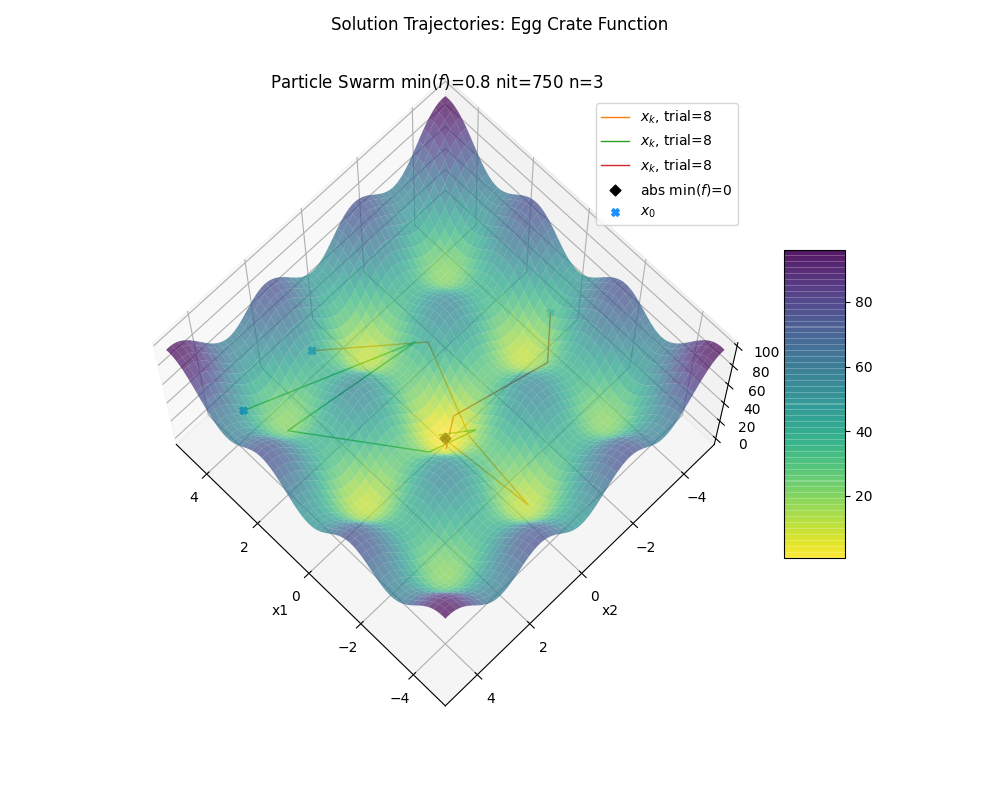

# viz-optimization-algorithms

Jupyter notebooks, scripts, and results associated with the paper _Visualization of Optimization Algorithms_ by Marco Morais (Morais, 2020).



Paper is available as [tex](Optimization-Visualization-mmorais2.tex) and [pdf](Optimization-Visualization-mmorais2.pdf).

I completed this project as the end of semester assignment for [CS 519 Scientific Visualization](https://uiucmcs.org/courses/CS-519-Scientific-Visualization) at UIUC.

If you find this repo helpful, please cite this paper and star this repository. Thank you!

```tex
@article{morais2020,
  title={Visualization of Optimization Algorithms},
  author={Morais, Marco},
  year={2020}
}
```

## Abstract
Optimization algorithms seek to find the best solution $x^{\*}$ from a set S such that $f(x^{\*}) \\leq f(x)$ for all $x$ in S. For this project we describe and implement a handful of optimization algorithms, evaluate their performance on some well known test functions, and create visualizations to build some intuition and verify their function.  Finally, we perform a comparative analysis between algorithms using repeated trials on these test functions in order to draw broader conclusions.

## Notebooks
Self contained notebook that contains all of the code and results that appear in the paper.

[Optimization-Visualization-mmorais2](Optimization-Visualization-mmorais2.ipynb)

### Test Functions

#### Rosenbrock
[Test-Function-Rosenbrock](Test-Function-Rosenbrock.ipynb)

#### Goldstein-Price
[Test-Function-Goldstein-Price](Test-Function-Goldstein-Price.ipynb)

#### Bartels-Conn
[Test-Function-Bartels-Conn](Test-Function-Bartels-Conn.ipynb)

#### Egg Crate
[Test-Function-Egg-Crate](Test-Function-Egg-Crate.ipynb)

### Optimization Algorithms

#### Gradient Descent
[Gradient-Descent](Gradient-Descent.ipynb)

#### BFGS
[BFGS](BFGS.ipynb)

#### Simulated Annealing
[Simulated-Annealing](Simulated-Annealing.ipynb)

#### Particle Swarm
[Particle-Swarm](Particle-Swarm.ipynb)

#### Misc

[Line-Search](Line-Search.ipynb)

### Visualizations

#### Test Functions
[Test-Function-Visualization-2D](Test-Function-Visualization-2D.ipynb)

#### Solutions, 2D
[Solution-Visualization-2D](Solution-Visualization-2D.ipynb)

#### Solutions, 3D
[Solution-Visualization-3D](Solution-Visualization-3D.ipynb)

#### Animations, 2D
[Solution-Animation-2D](Solution-Animation-2D.ipynb)

### Results

[Simulation-Results](Simulation-Results.ipynb)

### Videos
The table belows lists links to selected 2d animations referred to in the project and uploaded to youtube.

| Algorithm | Surface | Trial | Youtube Link |
|-|-|-|-|
| BFGS | Rosenbrock | 1 | [youtube](https://youtu.be/PDk9d_65sHs) |
| BFGS | Rosenbrock | 11 | [youtube](https://youtu.be/_HfCZAnnIgI) |
| BFGS | Goldstein-Price | 4 | [youtube](https://youtu.be/Y01H7iUr6js) |
| BFGS | Goldstein-Price | 5 | [youtube](https://youtu.be/fIyGMrPIsGk) |
| Simulated Annealing | Rosenbrock | 10 | [youtube](https://youtu.be/dcKCRAYu-Oo) |
| Simulated Annealing | Goldstein-Price | 6 | [youtube](https://youtu.be/AgMDXNWJH24) |
| Simulated Annealing | Bartels-Conn | 1 | [youtube](https://youtu.be/wp2_u-zHY7c) |
| Simulated Annealing | Bartels-Conn | 12 | [youtube](https://youtu.be/KKK3SiV80Ls) |
| Simulated Annealing | Egg Crate | 1 | [youtube](https://youtu.be/bfBrm2unoOg) |
| Particle Swarm | Rosenbrock | 5 | [youtube](https://youtu.be/SzwsbCBg-tk) |
| Particle Swarm | Goldstein-Price | 4 | [youtube](https://youtu.be/cyyI9hAzjqg) |
| Particle Swarm | Goldstein-Price | 7 | [youtube](https://youtu.be/sQjNwbgXpvc) |
| Particle Swarm | Goldstein-Price | 8 | [youtube](https://youtu.be/FIHklbjZrQ0) |
| Particle Swarm | Bartels-Conn | 2 | [youtube](https://youtu.be/crtcMyoKOzQ) |
| Particle Swarm | Egg Crate | 10 | [youtube](https://youtu.be/s9MEM_ML3kg) |
| Particle Swarm | Egg Crate | 11 | [youtube](https://youtu.be/Z0m8CiTAb3M) |
